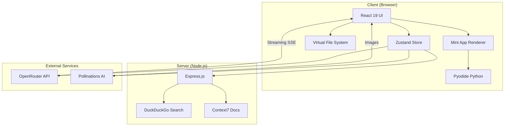
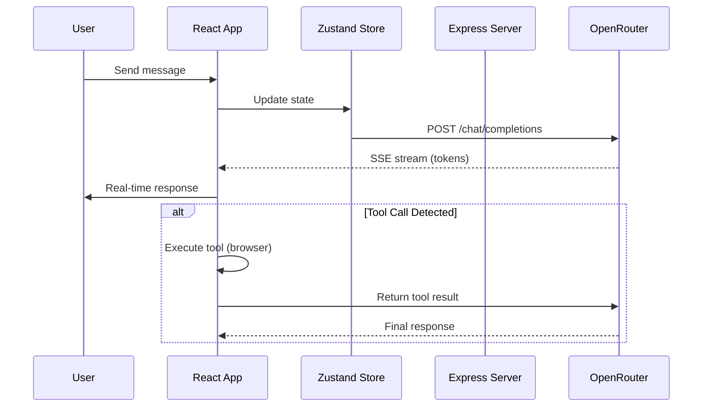

<div align="center">

# Throughthink

**High-performance AI gateway with zero vendor lock-in**

[](https://react.dev/)
[](https://www.typescriptlang.org/)
[](https://vitejs.dev/)
[](https://tailwindcss.com/)
[](https://zustand-demo.pmnd.rs/)
[](LICENSE)

*Pay per token. Access 300+ models. Zero rate limits.*

[Getting Started](#-getting-started) • [Architecture](#-architecture) • [Features](#-features) • [Performance](#-performance)

</div>

---

## Why Throughthink?

Traditional AI subscriptions lock you into a single provider with fixed monthly fees and arbitrary rate limits. Throughthink connects directly to OpenRouter's API, giving you:

| Throughthink | Traditional Subscriptions |
|:------------:|:------------------------:|
| **$0.50-2/month** average usage | $20/month minimum |
| **300+ models** via single API | 1-2 models per subscription |
| **Zero rate limits** | Hard message caps |
| **Pay per token** | Fixed monthly fee |
| **Switch models instantly** | Lock-in per provider |

---

## Architecture



### Data Flow



---

## Performance

### Why It's Fast

| Optimization | Impact |
|-------------|--------|
| **Vite HMR** | Sub-50ms hot reloads during development |
| **React 19** | Concurrent rendering, automatic batching |
| **IndexedDB** | Zero network latency for chat history |
| **Streaming SSE** | First token in <200ms (vs full response wait) |
| **Sucrase** | 10x faster JSX transforms for mini-apps |
| **Motion** | Hardware-accelerated 60fps animations |
| **CSS containment** | Layout thrashing prevention |

### Bundle Size

```
├── React + ReactDOM   142 KB
├── Zustand             2.8 KB
├── React Markdown     45 KB
├── Syntax Highlighter 78 KB (lazy)
├── Motion             32 KB
├── Tailwind (JIT)     8-15 KB (prod)
└── Total             ~300 KB (gzip)
```

---

## Features

### AI Tools

Throughthink includes built-in tools that the AI can use:

| Tool | Description |
|------|-------------|
| `generate_image` | Create images via Pollinations AI |
| `create_mini_app` | Build interactive React components |
| `run_python` | Execute Python in-browser with Pyodide |
| `write_file` / `read_file` | Virtual file system operations |
| `web_search` | Real-time web search via DuckDuckGo |
| `context7_search` | Documentation lookup for libraries |

### Mini Apps

AI-generated React applications render directly in chat:

```tsx
// AI generates this
export default function Counter() {
  const [count, setCount] = React.useState(0);
  return (
    <Card>
      <CardContent>
        <Button onClick={() => setCount(c => c + 1)}>
          Count: {count}
        </Button>
      </CardContent>
    </Card>
  );
}
```

### File Attachments

Support for document uploads:
- **Images**: Base64 encoded, sent directly to vision models
- **PDFs**: Text extraction for analysis
- **Word/Excel**: Content extraction (requires libraries)

---

## Getting Started

### Prerequisites

1. **OpenRouter API Key**
   - Sign up at [openrouter.ai](https://openrouter.ai)
   - Add credit ($5 recommended)
   - Generate key: `sk-or-v1-...`

### Installation

```bash
# Clone the repository
git clone https://github.com/juggperc/througthink-chat-monorepo.git
cd througthink-chat-monorepo

# Install dependencies
npm install

# Start development server
npm run dev
```

### Configuration

1. Open Settings (gear icon)
2. Paste your OpenRouter API key
3. Select a model (Gemini Flash recommended for speed)
4. Start chatting!

---

## Tech Stack

### Frontend

| Technology | Purpose |
|-----------|---------|
| React 19 | UI framework with concurrent features |
| TypeScript | Type safety |
| Vite 6 | Build tool, HMR, ES modules |
| Tailwind CSS 4 | Utility-first styling |
| Zustand 5 | State management |
| Motion | Animations |
| Lucide | Icons |

### Backend

| Technology | Purpose |
|-----------|---------|
| Express.js | API server |
| DuckDuckGo | Web search |
| Pyodide | Browser Python runtime |

### Storage

All data stored client-side in **IndexedDB**:
- Chat history
- API key
- Model preferences
- Virtual file system
- System prompts

---

## Project Structure

```
throughthink-chat/
├── components/
│   ├── ChatArea.tsx        # Message rendering
│   ├── MessageInput.tsx    # Input + attachments
│   ├── Sidebar.tsx         # Chat list
│   ├── Library.tsx         # Generated media
│   ├── FilesView.tsx       # VFS browser
│   ├── MiniAppRenderer.tsx # Live React renderer
│   ├── MarkdownRenderer.tsx# Syntax highlighting
│   └── ui/                 # Shadcn components
├── services/
│   ├── openrouter.ts       # Streaming API client
│   ├── mcp.ts              # Tool definitions
│   ├── vfs.ts              # Virtual file system
│   ├── python.ts           # Pyodide wrapper
│   └── fileParser.ts       # Document parsing
├── store/
│   └── chatStore.ts        # Zustand state
├── lib/
│   ├── i18n.ts             # Translations
│   └── utils.ts            # Helpers
└── server.ts               # Express backend
```

---

## Available Models

Pre-configured models include:

| Model | Use Case | Cost |
|-------|----------|------|
| Gemini 2.5 Flash | Fast responses | $0.075/1M tokens |
| Gemini 2.5 Pro | Complex reasoning | $1.25/1M tokens |
| Claude 3.5 Sonnet | Balanced | $3/1M tokens |
| GPT-4o | General purpose | $2.50/1M tokens |
| DeepSeek R1 | Reasoning | $0.55/1M tokens |
| Llama 3 70B | Open source | $0.70/1M tokens |

Add any OpenRouter model via Settings → Add Custom Model ID.

---

## Contributing

Contributions welcome! Please read our contributing guidelines before submitting PRs.

```bash
# Run in development
npm run dev

# Build for production
npm run build

# Preview production build
npm run preview
```

---

## License

MIT License - see [LICENSE](LICENSE) for details.

---

<div align="center">

**Built for thinkers who value performance over subscriptions.**

[Report Bug](https://github.com/juggperc/througthink-chat-monorepo/issues) • [Request Feature](https://github.com/juggperc/througthink-chat-monorepo/issues)

</div>
